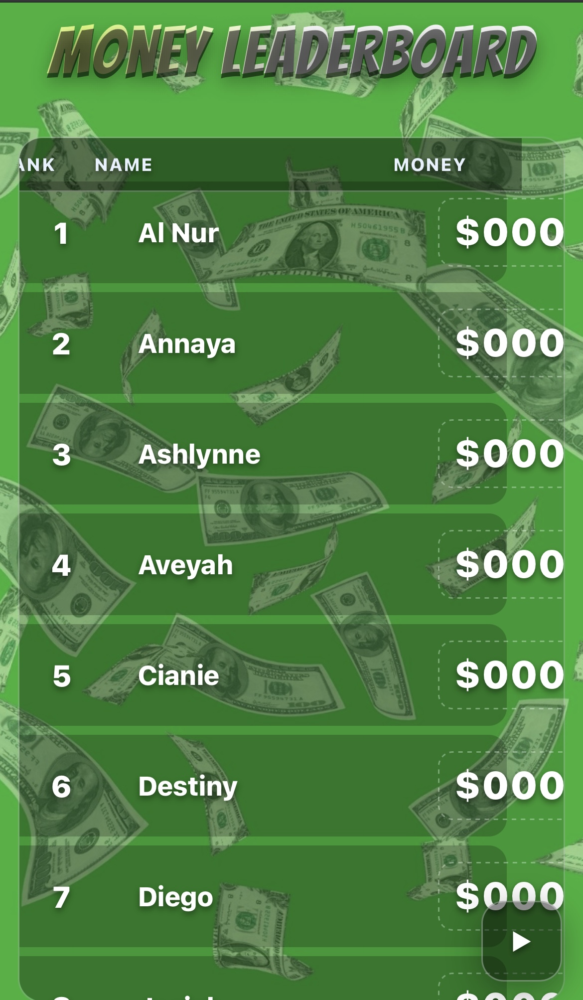

# 💵 Classroom Leaderboard

A stylish, money-themed classroom leaderboard built with **HTML**, **CSS**, and **JavaScript**.  
Designed to gamify learning by tracking student scores, rankings, and achievements through an interactive, animated interface.

---

## 🌐 Live Demo
👉 [View the Leaderboard](https://riahdollxo.github.io/classroom-leaderboard/)

---

## ✨ Features
- Add and update player names and scores  
- Animated money-themed visuals  
- Clean, responsive layout  
- Simple to customize for any classroom or competition  

---

## 🧠 Tech Stack
- **HTML5** — Structure  
- **CSS3** — Styling and animation  
- **JavaScript** — Logic and interactivity  

---

## 📸 Preview

---

## 👩🏽‍💻 About the Creator
Built by **Mariah Piggs** — a creative technologist and product-minded student passionate about blending design, innovation, and interactive learning.
