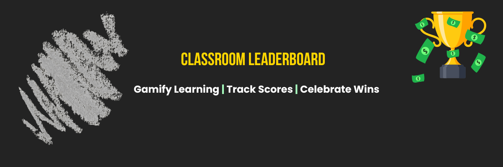

  

# 💵 Classroom Leaderboard

A stylish, money-themed classroom leaderboard built with **HTML**, **CSS**, and **JavaScript**.  
Designed to gamify learning by tracking student scores, rankings, and achievements through an interactive, animated interface.

---

## 🌐 Live Demo
👉 [View the Leaderboard](https://riahdollxo.github.io/classroom-leaderboard/)

---

## ✨ Features
- 🏆 Displays real-time student rankings  
- 💵 Money-themed animations for motivation  
- 🎯 Tracks scores, achievements, and progress  
- 🖥️ Built with HTML, CSS, and JavaScript  
- ⚡ Lightweight and responsive for all screens  

---

## 🧠 Tech Stack
| Technology | Purpose |
|-------------|----------|
| **HTML5** | Structure & layout |
| **CSS3** | Styling & animation |
| **JavaScript (ES6)** | Logic & interactivity |
| **GitHub Pages** | Deployment |

---

## 📸 Preview

---

## 👩🏽‍💻 About the Creator
**Mariah Piggs** — a creative technologist and product-minded student passionate about blending design, innovation, and interactive learning.🎓 Florida A&M University — Information Technology Major  
💬 Connect on [LinkedIn](https://www.linkedin.com/in/mariah-piggs-a428a589/)  
🌐 [GitHub](https://github.com/riahdollxo)

