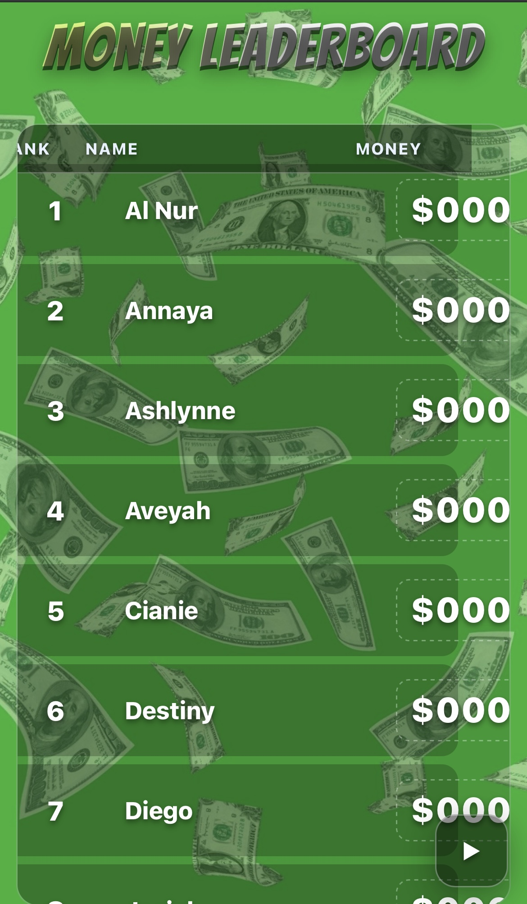

# 🏆 Classroom Leaderboard
<p align="center">
  <a href="LICENSE"></a>
  
  
  
</p>

A simple and interactive classroom leaderboard built with HTML, CSS, and JavaScript. This project demonstrates core front-end development concepts by allowing users to track and update participant scores in real time.

## 🌐 Live Demo

👉 [View the Leaderboard](https://riahdollxo.github.io/classroom-leaderboard/)

## 📸 Preview



## 📖 Overview

The Classroom Leaderboard was created to practice JavaScript, DOM manipulation, event handling, and responsive web design. Users can increase or decrease participant scores, making it useful as a classroom activity tracker, competition board, or learning exercise.

This project focuses on writing clean, readable code while creating an engaging and responsive user experience using only front-end technologies.

## ✨ Features

- 📈 Real-time score updates
- ➕ Increase participant scores
- ➖ Decrease participant scores
- 🖥️ Interactive leaderboard interface
- 📱 Responsive design
- 🎨 Clean and beginner-friendly code
- ⚡ No frameworks or external libraries

## 🛠️ Technologies Used

- HTML5
- CSS3
- JavaScript ES6

## 📂 Project Structure

```text
classroom-leaderboard/
│
├── index.html
├── style.css
├── script.js
├── IMG_7882.jpg
├── LICENSE
└── README.md
```

## 🚀 Getting Started

### Clone the repository

```bash
git clone https://github.com/riahdollxo/classroom-leaderboard.git
```

### Navigate to the project folder

```bash
cd classroom-leaderboard
```

### Open the project

Open `index.html` in your preferred web browser.

No installation or dependencies are required.

## 🎯 Learning Objectives

This project was created to strengthen understanding of:

- HTML page structure
- CSS styling and layout
- JavaScript fundamentals
- DOM manipulation
- Event listeners
- Responsive web design
- Project organization
- Version control with Git and GitHub

## 💡 Future Improvements

- Add players dynamically
- Store scores with Local Storage
- Team mode
- Score history
- Reset leaderboard button
- Dark mode
- Leaderboard sorting
- Win animations
- Sound effects
- Keyboard accessibility
- Mobile enhancements

## 📌 Roadmap

- [ ] Add Local Storage
- [ ] Add custom player creation
- [ ] Improve mobile responsiveness
- [ ] Add leaderboard sorting
- [ ] Add animations
- [ ] Improve accessibility

## 👩🏽‍💻 Author

### Mariah Piggs

Information Technology Student • Software Developer • AI Researcher

GitHub: https://github.com/riahdollxo

LinkedIn: https://linkedin.com/in/mariahpiggs

---

⭐ If you found this project helpful, please consider giving it a star!
